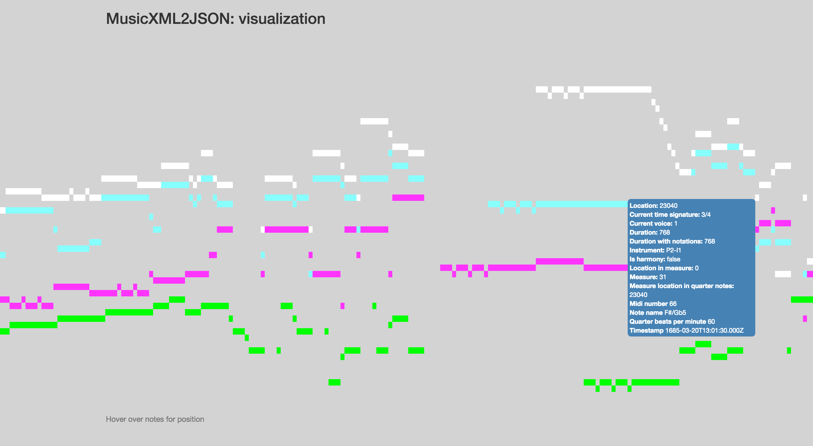

<h2>MusicXML2MusicJSON</h2>
<br>
<i>9th Aug 2016: Thanks for the ton of xml examples people have sent. This has broken alot of things, but will get it all working in the next couple of weeks </i>
<br>

<div>The purpose of this Node module is to convert MusicXML files into timestamped JSON files, in order to make this type of data more suited to time-series analysis and data visualization. MusicXML does not explicitly encode time information (in the sense that any particular note or rest can not be interrogated for its temporal position). MusicJSON sets out to solve this conundrum!</div>
<br>
<div><a href="#sample">Sample output</a></div>
<div><a href="#usage">Usage</a></div>
<div><a href="#testing">Testing, docs and visualization</a></div>
<div><a href="#attributes">Attributes description</a></div>
<div><a href="#issues">Issues and future work</a></div>

<a name="sample"></a>
<h3>Sample output</h3>


```javascript
    {
      "Midi number": -1,
      "Harmony note flag": false,
      "Current measure": 1,
      "Duration": 192,
      "Duration due to tied notes": 192,
      "Location": 0,
      "Location in measure": 0,
      "Measure location": 0,
      "Time signature numerator": 3,
      "Time signature denominator": 4,
      "Quarter beats per minute": 60,
      "Time stamp": "1685-03-20T13:00:00.000Z",
      "Instrument": "P1-I1",
      "Voice": 1
    },
    {
      "Midi number": 67,
      "Harmony note flag": false,
      "Current measure": 1,
      "Duration": 64,
      "Duration due to tied notes": 64,
      "Location": 192,
      "Location in measure": 192,
      "Measure location": 0,
      "Time signature numerator": 3,
      "Time signature denominator": 4,
      "Quarter beats per minute": 60,
      "Time stamp": "1685-03-20T13:00:00.750Z",
      "Instrument": "P1-I1",
      "Voice": 1
    },
```

<a name="usage"></a>
<h3>Usage</h3>
<div>After downloading and running npm install, use the MusicXML2MusicJSON module with the followng command. It will output a data.json file into the <i>./data</i> folder </div>
<br>
```javascript
node convertMusicXML2MusicJSON.js -f "pathToYouMusicXMLFile.xml"
```

<a name="testing"></a>
<h3>Testing, docs and visualization</h3>
<div>Code docs for the MusicXML2MusicJSON code can be found in the <i>out</i> folder and has been generated with <a href="http://usejsdoc.org/">JSDocs</a></div>
<br>
<div>The most convenient way I have found to test this data is by using a pianoroll visualization, so I have included this along the with the usual tests you would expect. This a tiny node/express app, and will look for data where the musicJSON file will be placed. </div>
<br>

```javascript
node visualizeData.js
```
<br>
<div> Runing the visualization command above will make the visualization available from localhost:8080 and will look something like figure 1. </div>
<br>
<h6>Figure 1.</h6>
<p align="center">
  
 
</p>

<a name="attributes"></a>
<h3>Attributes description</h3>

<h5>Instrument</h5>
<div>
   String with intrument name
</div>
<h5>Voice</h5>
<div>
   Integer as current voice number of note or rest
</div>

<h5>Midi number</h5>
<div>
   Integer between 0 and 127 where 60 = Middle C = C4 
</div>
<h5>Duration</h5>
<div>
   Integer indicating duration of a note or rest, where a quarter note = 256
</div>

<h5>Duration due to tied notes</h5>
<div>
   Modification of the <b>Duration</b> attribute as an integer value. Notes or rests that are tied to a next note will accumulate the duration of the next note. Notes that are tied to a prior note will have 0 value. This is the more accurate representation of duration
</div>

<h5>Harmony note flag</h5>
<div>
   Boolean value indicating note is part of a chord
</div>
<h5>Measure</h5>
<div>
   Integer representing current measure
</div>
<h5>Absolute Location</h5>
<div>
   Integer representing location of a beginning of a note of rest, where a quarter note = 256
</div>

<h5>Measure location</h5>
<div>
   Integer representing location of a the beginning of a measure,  where a quarter note = 256
</div>

<h5>Location in measure</h5>
<div>
   Integer representing the distance from the beginning of a note or rest to the beginning of the measure which it is in, where a quarter note = 256
</div>

<h5>Time signature numerator</h5>
<div>
   Integer representing number of beats in a measure
</div>

<h5>Time signature denominator</h5>
<div>
   Integer representing type of beats in a measure
</div>

<h5>Quarter beats per minute</h5>
<div>
   Integer representing a standard bpm metronome measure, however, all values are converted to calculate quarter note beats per minute. If no tempo information is availalbe from the MusicXML, the default value is 60
</div>
<h5>Timestamp</h5>
<div>
   Time in milliseconds of a note or rest relative to beginning of music, calculated from the Absolute Location and Quarter Beats Per Minute attributes
</div>

<a name="issues"></a>
<h3>Issues and Future work</h3>
<div>I have focused on the parts of a MusicXML specification that I need for a particular research project that centers around time, frequency, and location type information. I am also using a variation of this as a back end parser for my music search and analysis software at <a href="http://stelupa.com">stelupa.com</a>.</div>
<br>
<div>
A couple of ommissions to be fixed as soon as possible - encoding of global metadata is needed(things such as composed year etc), some more tests needed and also need to fix some tied note issues. There are also notations, attributes and directions (things like slurs, mordents, directions etc) and I will bring those over too, but still deciding how I want to structure that. Also, I am using Sibelius mostly to generate the MusicXML and I don't know if this will play nicely with MusicXML files generated in other ways. I will get to the bottom of that soon and at least make things compliant to MuseScore. Once I sort that stuff out I will release it into the wild as an npm module. If there is anything you want added let me know, or send a pull request.
</div>
<br>
<div>Jamie Gabriel</div>
<div><a href="http://biodigitaljazz.org">biodigitaljazz.org</a></div>
<div><a href="mailto:jgab3103@gmail.com">jgab3103@gmail.com</a></div>


